# Kien truc he thong

```mermaid
flowchart LR
  FB["Facebook Page Webhook"] --> WH["webhook-service :3001"]
  WH -->|"verify HMAC-SHA256"| N["Normalize raw payload"]
  N -->|"publish"| RAW["Kafka topic: raw_events"]
  RAW --> CORE["core-service consumer group"]
  CORE --> IDEM["Idempotency check"]
  IDEM --> RL["Rate limit"]
  RL --> SPAM["Spam detection"]
  SPAM --> AI["AI intent/sentiment"]
  AI --> DEC["Decision engine"]
  DEC --> CMD["Kafka topic: reply_commands"]
  DEC --> REVIEW["Kafka topic: manual_review"]
  CMD --> API["backend-api :3000"]
  RETRY_TOPIC["Kafka topic: send_retry"] --> API
  API --> FBAPI["Facebook Graph API"]
  FBAPI -->|"timeout/error"| FAIL["Kafka topic: send_failed"]
  FAIL --> RETRY["retry-service"]
  RETRY -->|"backoff chua het N lan"| RETRY_TOPIC
  RETRY -->|"exhausted"| DLQ["Kafka topic: dead_letter"]
  DLQ --> ALERT["Prometheus alert"]
```



## Schema raw event

```json
{
  "schemaVersion": "raw_event.v1",
  "eventId": "comment_123",
  "idempotencyKey": "facebook:comment:comment_123",
  "source": "facebook",
  "type": "comment",
  "pageId": "page_1",
  "actor": { "id": "user_1", "name": "Nguyen Van A" },
  "object": {
    "id": "comment_123",
    "parentId": "post_456",
    "postId": "post_456"
  },
  "text": "Shop oi gia bao nhieu?",
  "action": "add",
  "receivedAt": "2026-05-30T01:00:00.000Z",
  "occurredAt": "2026-05-30T01:00:00.000Z"
}
```

## Trang thai xu ly

- `received`: webhook da verify va publish vao `raw_events`.
- `processed`: core da phan loai va ra quyet dinh.
- `replied`: action auto reply thanh cong.
- `pending_review`: event can quan tri vien review.
- `failed`: loi downstream hoac loi pipeline co the retry.
- `dead_letter`: retry qua gioi han.

## Co che chong mat du lieu

- Kafka producer dung `acks=-1` va idempotent producer.
- Consumer commit offset thu cong sau khi handler xu ly xong.
- Message loi downstream duoc publish sang `send_failed`, khong mat trong pipeline.
- Retry-service day message sang `send_retry` sau exponential backoff, hoac `dead_letter` sau N lan that bai.

## Idempotency

`core-service` kiem tra `eventId` trong `data/events.json`. Neu event da co `processedAt`, consumer bo qua lan consume lap lai. `backend-api` kiem tra `commandId` trong `data/idempotency_keys.json` truoc khi goi Facebook de tranh reply trung.

## Rate limiting

Mac dinh 20 event trong 60 giay theo `actor.id`. Neu vuot nguong, event van duoc luu nhung chuyen `pending_review`, khong goi AI va khong auto reply.

## Circuit breaker

`backend-api` dem loi lien tiep khi goi Facebook Graph API. Neu dat `CIRCUIT_BREAKER_FAILURES`, service tam ngung goi trong `CIRCUIT_BREAKER_COOLDOWN_MS` va day command loi sang retry neu loi co the khoi phuc.
