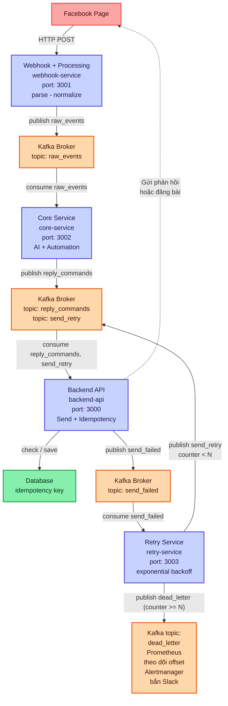

# 🚀 Hệ Thống Phân Tích Cảm Xúc AI & Tự Động Hóa Tương Tác Facebook (Facebook Webhook & Apache Kafka Pipeline)

[](https://github.com/cong-duc-pham/PhamCongDuc_6451071021_BTTH_API)
[](https://github.com/cong-duc-pham/PhamCongDuc_6451071021_BTTH_API)
[](https://github.com/cong-duc-pham/PhamCongDuc_6451071021_BTTH_API)

Repository này chứa chuỗi bài tập thực hành môn **Lập trình API (Học kỳ II - Năm III)** của sinh viên **Phạm Công Đức (MSV: 6451071021)**. Dự án xây dựng một hệ thống hoàn chỉnh từ các API truyền thống đến kiến trúc hướng sự kiện (EDA) quy mô lớn tích hợp Trí tuệ nhân tạo (AI) để phân tích ý định và tự động hóa phản hồi khách hàng trong thời gian thực.

---

## 🗺️ Sơ Đồ Kiến Trúc Hệ Thống 

Dưới đây là luồng xử lý sự kiện thời gian thực cực kỳ tối ưu, độc lập và khả năng mở rộng cao giữa các microservices thông qua **Apache Kafka Broker**:



---

## 📚 Tóm Tắt Các Bài Tập Thực Hành

| Danh Mục | Tên Dự Án / Thư Mục | Công Nghệ Chủ Chốt | Chức Năng Chính |
| :--- | :--- | :--- | :--- |
| **Bài 1** | [Bai1/PhamCongDuc_RestAPI_Customer](file:///c:/CongDuc/Ki_II_nam_III/API/BTchinh/Bai1/PhamCongDuc_RestAPI_Customer) | ASP.NET Core 8, EF Core, SQL Server, Swagger | • CRUD Khách hàng (`/api/customers`) có phân trang & validation.<br>• Proxy API kết nối Facebook Graph API.<br>• Cơ chế Retry exponential backoff cơ bản & ghi log request. |
| **Bài 2** | [Bai2](file:///c:/CongDuc/Ki_II_nam_III/API/BTchinh/Bai2) | Node.js, Apache Kafka, Docker Compose, Prometheus | • Xây dựng hệ thống 4 microservices bằng Node.js.<br>• Webhook tiếp nhận, giải mã và xác thực chữ ký HMAC-SHA256.<br>• Pipeline Kafka phân phối sự kiện thông qua các Topic nghiệp vụ.<br>• Prometheus đo lường và cảnh báo Dead Letter Queue (DLQ). |
| **Bài 3** | [Bai3](file:///c:/CongDuc/Ki_II_nam_III/API/BTchinh/Bai3) | Node.js, AI/Heuristics Sentiment, Kafka, Resilience | • **AI Sentiment & Intent**: Tự động nhận diện thái độ/ý định người dùng.<br>• **Quy tắc tự động hóa nâng cao**: Ẩn/Hiện bình luận, Tự động trả lời theo ngữ cảnh, Đưa spam vào danh sách đen (Blacklist).<br>• **Kháng lỗi cực cao**: Tích hợp **Circuit Breaker** & **Idempotency** chống trùng lặp. |

---

## 🛠️ Chi Tiết Từng Bài Tập Thực Hành

### 📂 Bài 1: REST API Khách Hàng & Facebook Page Backend Proxy
Được triển khai trên nền tảng **ASP.NET Core 8 Web API**, đóng vai trò là một dịch vụ quản lý khách hàng truyền thống và tạo cầu nối bảo mật với Facebook Graph API.

* **CRUD Khách Hàng nâng cao**: 
  * Lưu trữ trên cơ sở dữ liệu **SQL Server** thông qua **EF Core** (Mapping sang table `KhachHang`).
  * Kiểm tra tính hợp lệ dữ liệu chặt chẽ (Email duy nhất, đúng định dạng, giới hạn độ dài ký tự).
  * Hỗ trợ phân trang hiệu năng cao qua endpoint `/api/customers?page=1&pageSize=10`.
* **Facebook Proxy**:
  * Đóng gói và bảo vệ token Facebook phía máy chủ. Client gọi proxy thay vì gọi trực tiếp Facebook Graph API.
  * Hỗ trợ endpoints: Lấy danh sách bài viết (`GET /posts`), tạo bài viết (`POST /post`), lấy bình luận (`GET /comments`).
  * Xác thực qua custom header `X-Admin-Token` nhằm bảo mật tuyệt đối các thao tác quản trị.
  * Tự động ghi nhận log và thực hiện retry khi gặp lỗi tạm thời (Transient Errors 429/5xx).

---

### 📂 Bài 2: Hệ Thống Xử Lý Thời Gian Thực Với Webhook & Apache Kafka
Chuyển đổi sang kiến trúc **Event-Driven Architecture (EDA)** với 4 microservices độc lập giao tiếp bất đồng bộ qua **Kafka Topics**:

1. **`webhook-service` (Port 3001)**: Điểm tiếp nhận sự kiện từ Facebook. Xác thực nguồn gửi bằng chữ ký số `X-Hub-Signature-256` dựa trên thuật toán mã hóa `HMAC-SHA256` để loại bỏ request giả mạo. Chuẩn hóa payload sự kiện và đẩy vào topic `raw_events`.
2. **`core-service` (Port 3002)**: Đọc sự kiện từ `raw_events`, lọc trùng, phát hiện tin rác và phân tích cơ bản để sinh lệnh phản hồi, lưu kết quả vào topic `reply_commands`.
3. **`backend-api` (Port 3000)**: Consumse topic `reply_commands` và là **dịch vụ duy nhất** có quyền kết nối ra bên ngoài để gọi Facebook Graph API thực hiện phản hồi (trả lời comment, ẩn comment).
4. **`retry-service` (Port 3003)**: Lắng nghe topic `send_failed`, tính toán thời gian chờ theo công thức lũy thừa cơ số 2 (**Exponential Backoff**) `1s * 2^retry_count` và gửi lại yêu cầu thông qua topic `send_retry`. Nếu quá giới hạn cấu hình, tin nhắn lỗi sẽ được chuyển vào Dead Letter Queue (`dead_letter`) để quản trị viên xử lý thủ công.

---

### 📂 Bài 3: Trí Tuệ Nhân Tạo & Cơ Chế Kháng Lỗi Nâng Cao
Nâng cấp toàn diện hệ thống ở Bài 2 nhằm biến dự án thành một **Trợ lý tự động hóa bán hàng & chăm sóc khách hàng thông minh**:

* **AI Sentiment & Intent Engine**:
  * Phân tích nội dung bình luận để phân loại cảm xúc (`tich_cuc`, `tieu_cuc`, `trung_tinh`) và ý định (`hoi_gia`, `khieu_nai_ho_tro`, `khen_tuong_tac_tich_cuc`, `spam`).
* **Hệ Thống Luật Tự Động Hóa (Automation Rules)**:
  * **Cảm xúc tích cực**: Phản hồi lời cảm ơn ngọt ngào thân thiện (`thank_you` template).
  * **Ý định hỏi giá**: Tự động phản hồi hướng dẫn khách check inbox để nhận báo giá chi tiết (`inbox_quote` template).
  * **Cảm xúc tiêu cực / Khiếu nại**: Gửi lời xin lỗi chân thành và cam kết hỗ trợ nhanh nhất (`apology` template).
  * **Phát hiện Spam / Bot**: Tự động **ẩn bình luận** ngay lập tức để bảo vệ uy tín trang. Nếu spam cực kỳ nghiêm trọng, đẩy vào danh sách kiểm duyệt thủ công (`manual_review`) và tự động đưa ID người dùng vào **Blacklist nội bộ** nếu họ spam quá 3 lần trong vòng 24 giờ.
* **Cơ Chế Kháng Lỗi & Chống Trùng Lặp Cực Mạnh**:
  * **Idempotent Consumer**: Đảm bảo không xảy ra hiện tượng phản hồi lặp lại cho một khách hàng bằng cách lưu vết ID lệnh (`commandId`) vào `data/idempotency_keys.json`. Các lệnh trùng lặp sẽ bị loại bỏ ngay lập tức ở tầng đầu vào của `backend-api`.
  * **Circuit Breaker (Bộ Ngắt Mạch)**: Tự động ngắt kết nối tạm thời tới API Facebook khi phát hiện số lượng lỗi liên tục vượt ngưỡng (ví dụ: mất kết nối Internet hoặc Token hết hạn). Giúp hệ thống không bị quá tải và tránh việc spam request vô nghĩa.
  * **DLQ Alerting**: Prometheus liên tục giám sát số lượng tin nhắn trong Dead Letter Queue. Khi phát hiện `dead_letter_total > 0`, hệ thống sẽ kích hoạt trạng thái cảnh báo trên bảng điều khiển giám sát.

---

## ⚡ Hướng Dẫn Cài Đặt & Chạy Nhanh (Quick Start)

### 📌 Yêu Cầu Hệ Thống
* Máy tính đã cài đặt **Node.js (phiên bản v18 trở lên)**.
* Đã cài đặt **Docker Desktop** để chạy Kafka, Zookeeper và Prometheus.
* Đã cài đặt **.NET SDK 8.0** (cho Bài 1).

### 🚀 Các Bước Chạy Bài 2 & Bài 3

#### Bước 1: Khởi động môi trường Docker (Kafka, Zookeeper, Prometheus, Kafka UI)
Mở PowerShell/Terminal tại thư mục **Bài 3** (hoặc Bài 2) và gõ lệnh:
```powershell
# Di chuyển đến thư mục bài tập
cd c:\CongDuc\Ki_II_nam_III\API\BTchinh\Bai3

# Khởi động toàn bộ hạ tầng ngầm
docker compose up -d
```
> [!NOTE]
> Bạn có thể truy cập ngay vào giao diện **Kafka UI** tại địa chỉ: [http://localhost:8080](http://localhost:8080) để quản lý trực quan các Topics, Consumers, và Messages.

#### Bước 2: Thiết lập môi trường và cấu hình
Tạo file `.env` bằng cách copy từ file mẫu:
```powershell
Copy-Item .env.example .env
```
Mở file `.env` vừa tạo và điền các thông tin Meta Developer cần thiết:
```env
PORT_WEBHOOK=3001
PORT_CORE=3002
PORT_RETRIES=3003
PORT_BACKEND=3000

# Cấu hình Webhook & Bảo mật Facebook
FACEBOOK_APP_SECRET=your_app_secret
FACEBOOK_VERIFY_TOKEN=your_verify_token
FACEBOOK_PAGE_ID=your_page_id
FACEBOOK_PAGE_ACCESS_TOKEN=your_page_access_token

# Khóa quản trị cục bộ dùng cho client/dashboard gọi backend-api
ADMIN_TOKEN=local_admin_token

# (Tùy chọn) OpenAI API Key để phân tích AI chuyên sâu, nếu trống hệ thống tự chuyển sang Heuristics phân tích cục bộ
OPENAI_API_KEY=
```

#### Bước 3: Cài đặt thư viện và khởi động các Service
Cài đặt các gói npm cần thiết:
```powershell
npm install
```
Để thuận tiện cho quá trình phát triển, dự án đã tích hợp lệnh khởi động đồng thời cả 4 dịch vụ chỉ với một câu lệnh duy nhất:
```powershell
npm run dev:all
```
Các cổng dịch vụ sẽ hoạt động như sau:
* **`backend-api`**: [http://localhost:3000](http://localhost:3000)
* **`webhook-service`**: [http://localhost:3001](http://localhost:3001) (Tài liệu Swagger: [http://localhost:3001/docs](http://localhost:3001/docs))
* **`core-service`**: [http://localhost:3002](http://localhost:3002)
* **`retry-service`**: [http://localhost:3003](http://localhost:3003)

---

## 🧪 Kịch Bản Thử Nghiệm & Kiểm Thử Hệ Thống

Để thuận tiện cho việc chấm điểm và bảo cáo, bạn có thể thực hiện kiểm thử hệ thống thông qua công cụ dòng lệnh bằng cách gửi giả lập Webhook của Facebook:

### 1. Tạo Chữ Ký Xác Thực (Signature)
Để vượt qua lớp bảo mật `X-Hub-Signature-256` của `webhook-service`, bạn cần sinh mã băm đúng chuẩn:
```powershell
# Chạy script tạo mã băm với tham số: "APP_SECRET" và "Nội dung JSON của body"
node scripts/sign-payload.js "your_app_secret" '{"object":"page","entry":[{"id":"page_1","time":1710000000000,"changes":[{"field":"feed","value":{"item":"comment","verb":"add","comment_id":"comment_123","post_id":"post_456","from":{"id":"user_1","name":"Nguyen Van A"},"message":"Shop ho tro rat nhanh, san pham tot"}}]}]}'
```
Lệnh trên sẽ trả về chuỗi băm có dạng: `sha256=abcdef123456...`

### 2. Gửi Giả Lập Event lên Webhook Service
Sử dụng công cụ `curl` hoặc **Postman** gửi yêu cầu `POST` tới địa chỉ `http://localhost:3001/webhook` kèm theo Header `X-Hub-Signature-256` thu được ở bước trên.

#### 💡 Kịch bản kiểm thử hành vi AI lý tưởng:
* **Kịch bản 1: Cảm ơn sự tích cực**
  * **Nội dung tin**: `"Sản phẩm dùng cực kỳ ưng ý, shop tư vấn dễ thương!"`
  * **Kết quả**: Hệ thống nhận diện `sentiment = tich_cuc` và tự động gửi bình luận phản hồi: `"Cảm ơn bạn đã ủng hộ trang của chúng tôi!"`.
* **Kịch bản 2: Khiếu nại, phản hồi tiêu cực**
  * **Nội dung tin**: `"Ship hàng quá lâu, liên hệ shop không ai trả lời!!!"`
  * **Kết quả**: Nhận diện `sentiment = tieu_cuc`, tự động phản hồi bình luận: `"Chúng tôi chân thành xin lỗi vì sự bất tiện này. Đội ngũ hỗ trợ sẽ liên hệ trực tiếp với bạn ngay lập tức để giải quyết!"`.
* **Kịch bản 3: Hỏi giá dịch vụ**
  * **Nội dung tin**: `"Cái này giá bao nhiêu vậy shop ơi?"`
  * **Kết quả**: Nhận diện `intent = hoi_gia`, tự động phản hồi: `"Cảm ơn bạn đã quan tâm! Bạn vui lòng kiểm tra hộp thư đến (Inbox), shop đã nhắn tin báo giá chi tiết rồi ạ!"`.
* **Kịch bản 4: Xử lý Thư rác (Spam / Scam)**
  * **Nội dung tin**: `"Click vào đây nhận quà tặng 500k miễn phí ngay lập tức: http://scam-site.com"`
  * **Kết quả**: Nhận diện `intent = spam`, hệ thống tự động ẩn bình luận đó trên trang Facebook để tránh gây hại tới người dùng khác.

---

## 📈 Giám Sát Và Lưu Trữ Dữ Liệu Cục Bộ

Hệ thống ghi nhận trạng thái hoạt động trực tiếp vào các file lưu trữ cục bộ trong thư mục `data/` để dễ dàng kiểm tra mà không cần cài đặt thêm Database phức tạp:
* 🗂️ **`data/events.json`**: Lưu vết chi tiết lịch sử vòng đời của từng sự kiện (từ lúc tiếp nhận `received`, đang xử lý `processed`, đã phản hồi `replied`, bị lỗi `failed`, hoặc rơi vào `dead_letter`).
* 🗂️ **`data/idempotency_keys.json`**: Danh sách lưu trữ các ID lệnh đã thực hiện thành công nhằm chống trùng lặp.
* 🗂️ **`data/blacklist.json`**: Danh sách ID người dùng bị khóa bình luận do vi phạm spam quá giới hạn quy định.
* 🗂️ **`data/dead_letters.json`**: Lưu giữ thông tin của toàn bộ gói tin lỗi nghiêm trọng không thể khôi phục sau khi đã thử lại hết lượt.

---

## 👨‍💻 Tác Giả & Bản Quyền

* **Họ và tên**: Phạm Công Đức
* **Mã sinh viên**: 6451071021
* **Lớp**: Công nghệ thông tin - K64
* **Đề tài**: Bài tập thực hành lớn môn Lập trình API - Học kỳ II năm học thứ III.
* **Bản quyền**: Dự án được phân phối dưới giấy phép mở **MIT License**.
