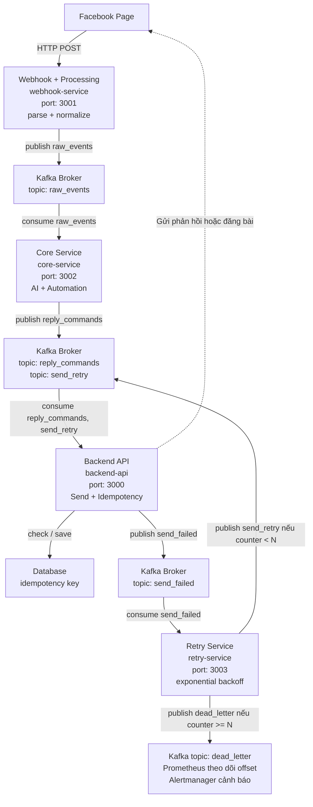

# PhamCongDuc_6451071021_BTTH_API

## Facebook Webhook + Kafka Automation Pipeline

Dự án xây dựng hệ thống tự động xử lý tương tác trên Facebook Page theo kiến trúc hướng sự kiện. Hệ thống không chia theo `Bai1`, `Bai2`, `Bai3` nữa, mà được tổ chức thành 4 service chính tương ứng với 4 port trong mô hình.

## Kiến Trúc Tổng Quan



## Cấu Trúc Project

```text
BTchinh/
├── backend-api/        # Port 3000 - gửi phản hồi lên Facebook, chống gửi trùng
├── webhook-service/    # Port 3001 - nhận webhook Facebook, parse và normalize event
├── core-service/       # Port 3002 - phân tích AI/heuristic và sinh lệnh automation
├── retry-service/      # Port 3003 - xử lý retry, exponential backoff, dead letter
├── shared/             # Cấu hình, Kafka client, logger, metrics, storage dùng chung
├── scripts/            # Script hỗ trợ test webhook/signature
├── monitoring/         # Prometheus và rule cảnh báo
├── data/               # Dữ liệu local runtime, không push GitHub
├── docker-compose.yml  # Kafka, Zookeeper, Kafka UI, Prometheus
├── package.json
├── package-lock.json
├── .env.example
└── README.md
```

## 4 Service Chính

| Service | Port | Vai trò |
| --- | ---: | --- |
| `backend-api` | `3000` | Gọi Facebook Graph API để reply comment, hide comment, lấy post/comment; kiểm tra idempotency để tránh phản hồi trùng. |
| `webhook-service` | `3001` | Nhận webhook từ Facebook, xác thực chữ ký `X-Hub-Signature-256`, chuẩn hóa payload rồi publish vào Kafka topic `raw_events`. |
| `core-service` | `3002` | Consume `raw_events`, phân tích sentiment/intent, phát hiện spam, blacklist, sau đó tạo command vào `reply_commands` hoặc `manual_review`. |
| `retry-service` | `3003` | Consume `send_failed`, retry theo exponential backoff, quá số lần thì chuyển sang `dead_letter`. |

## Kafka Topics

| Topic | Chức năng |
| --- | --- |
| `raw_events` | Chứa event đã normalize từ webhook-service. |
| `reply_commands` | Chứa lệnh phản hồi/hide comment do core-service tạo. |
| `send_retry` | Chứa lệnh cần gửi lại sau khi lỗi tạm thời. |
| `send_failed` | Chứa lệnh gửi Facebook thất bại. |
| `dead_letter` | Chứa lệnh lỗi quá số lần retry cho quản trị viên xử lý. |
| `manual_review` | Chứa comment cần kiểm duyệt thủ công. |

## Yêu Cầu Cài Đặt

- Node.js từ phiên bản 18 trở lên.
- Docker Desktop.
- Facebook Page Access Token có quyền quản lý Page.
- Meta App Secret và Verify Token để cấu hình webhook.

## Cấu Hình Môi Trường

Tạo file `.env` từ file mẫu:

```powershell
Copy-Item .env.example .env
```

Cập nhật các giá trị chính trong `.env`:

```env
BACKEND_PORT=3000
WEBHOOK_PORT=3001
CORE_METRICS_PORT=3002
RETRY_METRICS_PORT=3003

FACEBOOK_APP_SECRET=replace_with_meta_app_secret
FACEBOOK_VERIFY_TOKEN=replace_with_any_verify_token_you_choose
FACEBOOK_PAGE_ID=replace_with_page_id
FACEBOOK_PAGE_ACCESS_TOKEN=replace_with_page_access_token
ADMIN_TOKEN=local_admin_token

KAFKA_BROKERS=localhost:9092
KAFKA_CLIENT_ID=fb-ai-automation-system
CORE_CONSUMER_GROUP=core-service-group

TOPIC_RAW_EVENTS=raw_events
TOPIC_REPLY_COMMANDS=reply_commands
TOPIC_SEND_RETRY=send_retry
TOPIC_SEND_FAILED=send_failed
TOPIC_DEAD_LETTER=dead_letter
TOPIC_MANUAL_REVIEW=manual_review

DATA_DIR=./data
```

Không push file `.env` lên GitHub. File này đã được chặn trong `.gitignore`.

## Chạy Project

Mở terminal tại thư mục root `BTchinh`.

### 1. Cài dependencies

```powershell
npm install
```

### 2. Chạy Kafka, Kafka UI và Prometheus

```powershell
docker compose up -d
```

Kafka UI:

```text
http://localhost:8080
```

Prometheus:

```text
http://localhost:9090
```

### 3. Chạy 4 service

```powershell
npm run dev:all
```

Hoặc chạy từng service:

```powershell
npm run start:backend
npm run start:webhook
npm run start:core
npm run start:retry
```

## Health Check

```text
http://localhost:3000/health
http://localhost:3001/health
http://localhost:3002/health
http://localhost:3003/health
```

## Swagger / API Docs

Webhook Service docs:

```text
http://localhost:3001/docs
```

Backend API endpoints chính:

```text
GET  /posts
POST /post
GET  /comments
```

Các endpoint quản trị cần header:

```text
X-Admin-Token: local_admin_token
```

## Test Nhanh Bằng Curl

Lấy danh sách post:

```powershell
curl.exe "http://localhost:3000/posts?limit=10" -H "X-Admin-Token: local_admin_token"
```

Lấy comment:

```powershell
curl.exe "http://localhost:3000/comments?postId=POST_ID&limit=10" -H "X-Admin-Token: local_admin_token"
```

Đăng bài:

```powershell
curl.exe -X POST "http://localhost:3000/post" `
  -H "Content-Type: application/json" `
  -H "X-Admin-Token: local_admin_token" `
  -d "{\"message\":\"Test API Facebook Page\"}"
```

## Test Bằng Facebook Comment

Sau khi cấu hình webhook URL trong Meta Developer, comment trực tiếp vào bài viết của Page để kiểm tra pipeline:

| Nội dung comment | Kết quả mong đợi |
| --- | --- |
| `Shop ơi giá bao nhiêu vậy?` | Hệ thống nhận diện hỏi giá và tự động reply hướng dẫn inbox/báo giá. |
| `Shop hỗ trợ rất nhanh, sản phẩm rất tốt` | Hệ thống nhận diện tích cực và reply cảm ơn. |
| `Ship giao hàng lâu quá, mình chưa nhận được hàng` | Hệ thống nhận diện khiếu nại và reply xin lỗi/hỗ trợ. |
| `Nhận quà miễn phí click ngay https://spam.example.com` | Hệ thống nhận diện spam và ẩn comment. |

## Kiểm Tra Kafka

Vào Kafka UI:

```text
http://localhost:8080
```

Theo dõi các topic:

- `raw_events`
- `reply_commands`
- `send_failed`
- `send_retry`
- `dead_letter`
- `manual_review`

Luồng đúng khi test Facebook comment:

```text
Facebook comment
-> webhook-service
-> raw_events
-> core-service
-> reply_commands / manual_review
-> backend-api
-> Facebook Graph API
```

Nếu gửi Facebook thất bại:

```text
backend-api
-> send_failed
-> retry-service
-> send_retry
-> backend-api
```

Nếu retry quá số lần:

```text
retry-service
-> dead_letter
```

## Bảo Mật Khi Push GitHub

Các file không được push:

- `.env`
- `data/`
- `node_modules/`
- file log

File được push để người khác cấu hình lại:

- `.env.example`

Nếu token Facebook từng bị push lên GitHub, cần tạo token mới trong Meta Developer vì token cũ có thể đã bị lộ.

## Tác Giả

- Họ tên: Phạm Công Đức
- Mã sinh viên: 6451071021
- Môn học: Lập trình API
